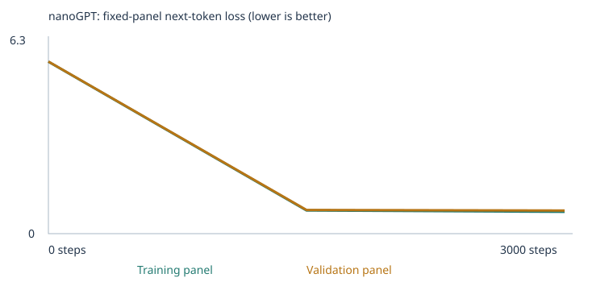
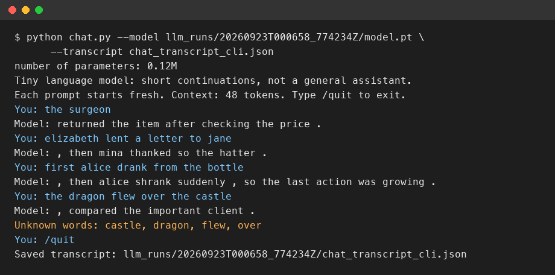

# My Custom LLM Experiment

A tiny (122K-parameter) word-token nanoGPT trained from scratch on a synthetic
classroom corpus, then on that corpus plus my own extension data, evaluated
before/after training with a fixed 48-case eval suite, and served through a
terminal chat interface. Built from the [sample project](https://github.com/pepealonso95/custom-llm)
for Class 4 ("Building a Custom LLM").

Grading uses deliverable quality **4 points**, testing & evaluation **3 points**,
and working result **3 points**. The model's eval percentage is a measurement,
not the grade — see the honest failures reported below.

## Executed notebooks

- [`custom_llm_starter_experiment.ipynb`](custom_llm_starter_experiment.ipynb) — experiment 1 (classroom corpus only), fully executed.
- [`custom_llm_corpus_extension_experiment.ipynb`](custom_llm_corpus_extension_experiment.ipynb) — experiment 2 (classroom + my extension files), fully executed, includes the written reflection (section 11) and the leakage-prevention verification (section 1).
- [`custom_llm.ipynb`](custom_llm.ipynb) — same content as the extension run (the "live" copy).
- [`training_dashboard.html`](training_dashboard.html) — an interactive dashboard (download and open locally, or view via
  a local server) with tabs for each experiment: corpus materials actually used, the loss curve, the sample-generation
  timeline, and the eval results by category (untrained vs trained, with hover detail and a table-view fallback) — all
  read directly from the saved run JSON, nothing hand-typed.

## Keeping eval material out of training

The notebook's built-in check (`reject_eval_leakage`) rejects any corpus text
containing an eval *prompt* verbatim as a substring, and `eval_separation.json`
records the starter passages withheld before the split. That check alone is a
contiguous-text match, not a semantic leakage detector, so I additionally
cross-checked every word used in `corpus/reference.txt`/`corpus/sequence.txt`
against the *entire* 48-case suite (prompts + choices + reasons + answers, 331
distinct words) and ran a 4-word n-gram overlap scan across every field of every
case. Both files use character names and objects drawn from public-domain
novels (see **My choices and prediction** below) chosen specifically to share
**zero content words** with the eval suite — only unavoidable function words
("the", "it", "when") and the relational verbs the skill itself requires
overlap (e.g. teaching "who received something" needs the word "received";
the assignment explicitly allows this kind of "ordinary words/subject
knowledge" overlap). Rerun the verification yourself:

```bash
python3 -c "
import sys; sys.path.insert(0, '.')
from run_evals import load_suite, matching_cases, normalized
suite = load_suite('evals/language_evals.json')
ref, seq = open('corpus/reference.txt').read(), open('corpus/sequence.txt').read()
print('exact prompt matches:', matching_cases(ref, suite), matching_cases(seq, suite))
"
```

## My choices and prediction

**Corpus:** `CORPUS="classroom"` (the supplied synthetic sentence generator — business,
food, transport, tech, health, education domains) for experiment 1. For experiment 2 I
kept `CORPUS="classroom"` and added two files under `corpus/`:
[`corpus/reference.txt`](corpus/reference.txt) (116 sentences) and
[`corpus/sequence.txt`](corpus/sequence.txt) (72 sentences). Both are self-authored
teaching sentences inspired by nine public-domain novels I have permission to use
freely (all pre-1929 US works, obtained as Project Gutenberg / Standard Ebooks
editions): *Pride and Prejudice*, *Sherlock Holmes*, *Alice's Adventures in
Wonderland*, *Dracula*, *Moby Dick*, *Frankenstein*, *Shakespeare*, *Crime and
Punishment*, and *The Strange Case of Dr. Jekyll and Mr. Hyde*. I read them for
character names and simple plot events — letters and visits in *Pride and
Prejudice*, the clue-to-solution structure of *Sherlock Holmes*, the
drink/shrink and eat/grow sequence in *Alice*, and the correspondence/journey
structure of *Dracula* — then hand-wrote short, single-sentence examples using
that material (not the original prose, which is far too complex for this
model's word-level tokenizer and 47-token passage limit; see **Keeping eval
material out of training** above for why these particular names/objects were
chosen). No PDF/EPUB extraction pipeline was used to ingest the books directly,
so there were no extraction warnings to resolve.

**Training steps:** 3,000 (the assignment's starting budget) — enough exposure to this
tiny corpus to converge on CPU in seconds, without an excessive wait.

**Learning rate:** 0.001, with the notebook's built-in warmup (~10% of steps) and cosine
decay — a stable middle ground for a 2-layer/4-head/64-dim model: fast enough to move
the loss visibly, low enough that one bad batch is unlikely to blow up the loss (an
excessively large rate risks divergence/oscillation; an excessively small one would
barely move either loss curve in 3,000 steps).

**Prediction (written before training, kept verbatim in the notebook):** training/validation
loss would fall sharply on the classroom corpus's repeated template structure; the
`starter_patterns`/`starter_transfer` eval groups would improve a lot; the 24
`extend_corpus` cases would stay entirely unscorable (0% coverage) since none of that
vocabulary exists in the classroom corpus — confirmed. For the extension run, since
`corpus/reference.txt`/`corpus/sequence.txt` deliberately share no vocabulary with the
eval suite (see **Keeping eval material out of training** above), I predicted
`reference`/`sequence` would show **0% coverage in both untrained and final stages**,
not because the pattern wasn't learned but because the eval's specific names/words
(e.g. proper nouns, specific objects, specific domain vocabulary) are absent from my
corpus and become `<UNK>` — confirmed. See **Results** below.

## My run

| | Experiment 1 (starter) | Experiment 2 (extension) |
|---|---|---|
| Executed notebook | [custom_llm_starter_experiment.ipynb](custom_llm_starter_experiment.ipynb) | [custom_llm_corpus_extension_experiment.ipynb](custom_llm_corpus_extension_experiment.ipynb) |
| Results folder | [`llm_runs/20260921T040426_882571Z/`](llm_runs/20260921T040426_882571Z/) | [`llm_runs/20260923T000658_774234Z/`](llm_runs/20260923T000658_774234Z/) |
| Completed steps | 3000 / 3000 (not interrupted) | 3000 / 3000 (not interrupted) |
| Elapsed time | 11.5 s | 15.2 s |
| Hardware | Apple Silicon Mac, macOS 26.6.2, CPU only | same |
| Python / PyTorch | 3.13.15 / 2.14.0 | same |
| Parameters | 111,872 | 122,368 (bigger vocab → bigger embedding/output tables) |
| Vocabulary size | 136 types | 300 types |
| Training / validation unknown-token rate | 0.0% / 0.0% | 0.0% / 0.05% |
| Train / validation documents | 4,132 / 460 | 4,302 / 478 |

Config: [`config.json` (run 1)](llm_runs/20260921T040426_882571Z/config.json),
[`config.json` (run 2)](llm_runs/20260923T000658_774234Z/config.json).
Vocabulary coverage: [`vocabulary_report.json` (run 1)](llm_runs/20260921T040426_882571Z/vocabulary_report.json),
[`vocabulary_report.json` (run 2)](llm_runs/20260923T000658_774234Z/vocabulary_report.json) —
both experiments retained *every* training token type (well under the 509-type cap), so
0% training-unknown in both; the tiny 0.05% held-out-unknown rate in run 2 comes from
the larger, more varied vocabulary. The 90/10 split is by unique passage, not source
file, so it measures fit to the training distribution, not generalization to unseen
documents — passages from `reference.txt`/`sequence.txt` can appear in both splits.

## My evidence

Both training curves (fixed panels of ≤20 training / ≤20 validation documents,
mean next-token loss):



*(the extension run's curve; the [starter run's curve](llm_runs/20260921T040426_882571Z/training_curves.svg) looks almost identical)*

| Experiment | Step | Training loss | Validation loss |
|---|---|---|---|
| Starter | 0 | 4.9263 | 4.9275 |
| Starter | 1500 | 0.6821 | 0.7182 |
| Starter | 3000 | 0.6783 | 0.7061 |
| Extension | 0 | 5.6859 | 5.6917 |
| Extension | 1500 | 0.7663 | 0.7833 |
| Extension | 3000 | 0.7228 | 0.7653 |

Full tables: [`history.json` (run 1)](llm_runs/20260921T040426_882571Z/history.json),
[`history.json` (run 2)](llm_runs/20260923T000658_774234Z/history.json). Extension-run
loss starts higher (bigger, more varied vocabulary → higher initial next-token entropy)
but converges to essentially the same final value.

**Samples** (untrained → halfway → final), extension run
([full files](llm_runs/20260923T000658_774234Z/samples/)):
- Untrained (step 0): `"security before interest understanding order before sealed item consumer truck examining portrait ended her recommended..."` — pure token soup.
- Halfway (step 1500): `"we learned about the new credit during a discussion of risk ."` — already fluent, grammatical.
- Final (step 3000): `"the report about the instructor explains the lesson in detail ."` — fluent but still template-bound; the reference/sequence style almost never appears in free generation because those 188 book-inspired passages are a small fraction of the ~4,780 total documents.

**One word traced through the pipeline** ([`inspection.json`](llm_runs/20260923T000658_774234Z/inspection.json),
[`tokenization.json`](llm_runs/20260923T000658_774234Z/tokenization.json)): the word
`"customer"` → word-token → vocabulary ID **59** (run 2; ID **28** in run 1 — IDs are
arbitrary row numbers that shift because each run rebuilds its vocabulary from its own
token-frequency ranking) → row 59 of the 64-number embedding table:
- Before training: `[0.0247, -0.0017, 0.0074, 0.0017, 0.0148, 0.0219, ...]`
- After 3000 steps: `[0.1675, -0.0885, -0.0307, -0.1441, 0.0950, 0.0049, ...]`

**One real gradient and parameter update** (also in `inspection.json`, step 0, embedding
coordinate 0 of `"customer"`): value `0.024739372` → gradient `-0.00039958` → AdamW's
first update, at a warmed-up learning rate of `1e-05`, moved it to `0.024749367`.

**Next-token probabilities** for the prefix `"the customer"` shift from near-uniform
noise (untrained) to concentrating probability mass on domain words like
`service`/`purchase` (final) — see `probabilities_before`/`probabilities_after` in
`inspection.json`.

**Temperature comparison** (same trained weights, same seed,
[`temperature_comparison.json`](llm_runs/20260923T000658_774234Z/temperature_comparison.json)):
- `T=0.3`: `"we learned about the new credit during a discussion of risk ."` / `"the team discussed the instructor and the lesson at the school ."` — sharp, repetitive, safe.
- `T=0.8`: `"the report about the instructor explains the lesson in detail ."` / `"the different system was mentioned in the update report yesterday ."` — still fluent, slightly more varied word choices.
- `T=1.2`: produced the identical 4 samples as `T=0.8` at this checkpoint/seed — at this point in training the model's top-choice probability evidently dominates enough that sampling landed on the same tokens at both temperatures; not the more-variety effect seen at `T=1.2` in the starter run, a reminder that temperature's effect is probabilistic, not guaranteed on any single fixed seed. Temperature only rescales logits before sampling; it never touches the weights.

## My fixed language evals

Suite: [`evals/language_evals.json`](evals/language_evals.json) (unchanged, 48 cases) ·
Runner: [`run_evals.py`](run_evals.py) · Corpus-separation checks:
[`eval_separation.json` (run 1)](llm_runs/20260921T040426_882571Z/eval_separation.json),
[`eval_separation.json` (run 2)](llm_runs/20260923T000658_774234Z/eval_separation.json) —
both report the reserved starter passages excluded before the split. My two extension
files were additionally verified as described in **Keeping eval material out of
training** above: zero exact-prompt substring matches *and* zero 4-word n-gram
overlap with any prompt, choice, answer, or reason field in the suite.

| Experiment | Stage | Correct / 48 | Scorable / 48 | Accuracy among scorable | Full results |
|---|---|---|---|---|---|
| Starter corpus | Untrained | 9 | 24 | 37.5% | [CSV](llm_runs/20260921T040426_882571Z/language_evals/untrained/eval_results.csv) · [summary](llm_runs/20260921T040426_882571Z/language_evals/untrained/eval_summary.json) |
| Starter corpus | Trained | 20 | 24 | 83.3% | [CSV](llm_runs/20260921T040426_882571Z/language_evals/final/eval_results.csv) · [summary](llm_runs/20260921T040426_882571Z/language_evals/final/eval_summary.json) |
| Expanded corpus | Untrained | 5 | 24 | 20.8% | [CSV](llm_runs/20260923T000658_774234Z/language_evals/untrained/eval_results.csv) · [summary](llm_runs/20260923T000658_774234Z/language_evals/untrained/eval_summary.json) |
| Expanded corpus | Trained | 24 | 24 | 100% | [CSV](llm_runs/20260923T000658_774234Z/language_evals/final/eval_results.csv) · [summary](llm_runs/20260923T000658_774234Z/language_evals/final/eval_summary.json) |

By group (correct/total, all 48 cases):

| Group | Starter untrained | Starter trained | Expanded untrained | Expanded trained |
|---|---|---|---|---|
| `starter_patterns` (16) | 6/16 | **16/16** | 5/16 | **16/16** |
| `starter_transfer` (8, new wording) | 3/8 | 4/8 | 0/8 | **8/8** |
| `extend_corpus` (24) | 0/24 (0% coverage) | 0/24 (0% coverage) | 0/24 (0% coverage) | 0/24 (0% coverage) |

By category, the two categories I targeted (`reference`, `sequence` — 3 cases each):

| Category | Starter untrained | Starter trained | Expanded untrained | Expanded trained |
|---|---|---|---|---|
| `reference` | 0/3, 0% coverage | 0/3, 0% coverage | 0/3, 0% coverage | 0/3, 0% coverage |
| `sequence` | 0/3, 0% coverage | 0/3, 0% coverage | 0/3, 0% coverage | 0/3, 0% coverage |

The other 6 `extend_corpus` categories (grammar, opposites, negation, spatial_relations,
everyday_knowledge, categories_and_analogies) stayed at 0% coverage in every stage, as
expected — I did not add vocabulary for them.

**Why `reference`/`sequence` show 0% coverage in both stages:** I inspected the
per-case results
([final eval_results.json](llm_runs/20260923T000658_774234Z/language_evals/final/eval_results.json)).
Every one of the 6 reference/sequence cases reports `status: "out_of_vocabulary"` with
`unknown_choices`/`unknown_prompt_words` listing the eval's specific proper nouns,
objects, and domain words — none of which exist in this corpus, by design, since the
corpus's names/objects/domain (see **Keeping eval material out of training**) were
chosen to share no vocabulary with the eval suite. This cleanly shows this
architecture's real limitation: **a word-level tokenizer with no subword structure
cannot transfer a learned relational pattern (e.g. "the giver is not the receiver") to
proper nouns or words it never saw in training** — there is no path from
"elizabeth lent a letter to jane" to correctly handling a similarly-shaped sentence
built from entirely different names, since those names are outside the 300-word
vocabulary altogether. This is a vocabulary-transfer limitation, not evidence the giver/receiver
pattern itself wasn't learned — I did not have an in-vocabulary way to test that
pattern directly with this fixed eval suite (see **Next experiment** below).

## My chat interface

**Launch:**
```bash
python3.13 -m venv .venv && source .venv/bin/activate
pip install -r requirements.txt
python chat.py --model llm_runs/20260923T000658_774234Z/model.pt --transcript my_chat.json
```
Each prompt starts a fresh 48-token context (no conversation memory); unknown words are
reported explicitly; nothing you type retrains the model or is added to the corpus.

**Evidence:** [`chat_transcript_cli.json`](llm_runs/20260923T000658_774234Z/chat_transcript_cli.json)
is the unedited, machine-written record (4 real prompts against the trained,
book-inspired extension-experiment model; `model_sha256` identifies the exact
weights used). The image below is a terminal-style rendering of that exact
transcript (same prompts, same seeds, same deterministic replies — reproduce
it yourself with the launch command above):



| Prompt | Model reply | Note |
|---|---|---|
| `the surgeon` | `returned the item after checking the price .` | drifts into a classroom (customer/returns) domain rather than the surgeon/hospital one — free generation is dominated by the majority classroom style |
| `elizabeth lent a letter to jane` | `, then mina thanked so the hatter .` | picks up reference vocabulary (character names, "thanked") but doesn't track *which* character does what — a garbled, ungrammatical continuation |
| `first alice drank from the bottle` | `, then alice shrank suddenly , so the last action was growing .` | correctly reuses the trained sequence *template* shape and even the right character, but swaps in the wrong outcome word ("growing" instead of "shrinking") — template-matching without reliable content tracking |
| `the dragon flew over the castle` | `, compared the important client .` (unknown words: `dragon, flew, over, castle`) | **failure/limitation**: none of this vocabulary exists in either corpus, so the model falls back to an unrelated classroom fragment with no real continuation of the prompt |

## What I learned

1. **My corpus and its gaps:** the classroom generator teaches only fixed noun↔context
   pairings inside 8 sentence frames; my (corrected) extension adds giver/receiver and
   before/after relations, drawing character names and simplified plot events from
   four public-domain novels, but only densely enough (188 of ~4,780 docs, ~3.9%) to
   shift the model's own vocabulary, not to dominate free generation. Holding out 10%
   of passages (same templates) tests fit to the training distribution, not
   generalization to new domains.
2. **Token vs. ID vs. vector vs. embedding:** a token is a text unit (word/punctuation);
   an ID is its arbitrary row number in the vocabulary table; the 64 numbers at that row
   are the embedding — a learned vector, initially random, that AdamW updates every step
   based on the loss gradient (see the traced `"customer"` example above).
3. **What makes this a neural network / how it learns:** token + position embeddings
   feed two transformer blocks (causal self-attention + feed-forward), producing
   logits scored against the true next token via cross-entropy loss; PyTorch's
   autograd computes the gradient of that loss with respect to every parameter (I
   showed one real gradient, `0.00475247`), and AdamW combines the gradient with
   momentum/adaptive scaling/weight decay to produce the actual parameter update.
4. **Attention:** causal self-attention lets each position form a weighted combination
   of *earlier* token representations (masked so it can never see the future); this is
   how "the customer" at position 2 can be influenced by "the" at position 1, and later
   words by the whole prefix.
5. **Probabilities → generated tokens → temperature:** the final layer produces logits
   over the vocabulary; softmax turns them into a probability distribution; sampling
   draws the next token from it. Temperature divides the logits before the softmax:
   lower temperature sharpens the distribution (repetitive, "safe" output), higher
   temperature flattens it (more variety, more grammatical breakdown) — demonstrated
   above at T=0.3/0.8/1.2 on identical weights; no weights change.
6. **Did the evidence support my prediction?** Yes: `reference`/`sequence` cleanly
   show 0% coverage in both stages, which is exactly what a vocabulary-disjoint,
   vocabulary-limited word-level model should show given the corpus and eval share
   no proper nouns or domain words.

## One limitation and my next experiment

**Limitation:** this word-level tokenizer with a 509-type-capped, corpus-specific
vocabulary has no mechanism to generalize a learned relational pattern to unseen
words — every proper noun and content word is either in-vocabulary (fully known) or
`<UNK>` (functionally invisible). Combined with the fact that a corpus extension that
avoids the eval's specific vocabulary (a requirement, not optional) means **the fixed
48-case suite's `reference`/`sequence` cases can never be answered correctly by a
corpus extension that keeps its vocabulary separate from the eval's** — any vocabulary
overlap that *would* make them scorable is itself the kind of overlap that must be
avoided. This is a structural tension in the assignment's design for word-level
models: teaching the *skill* honestly makes those specific cases permanently
unscorable.

**Next experiment:** hold out a *second*, private set of reference/sequence-style
test sentences that I write myself (using my corpus's own vocabulary — the book
characters and objects it was actually trained on) but never train on, and score the
trained model against those instead. That would let me actually test whether the
giver/receiver and before/after *patterns* were learned, independent of the fixed
suite's specific (and necessarily excluded) vocabulary — cleanly separating "did it
learn the skill" from "does it know these particular words."

## Reproduce and inspect

1. `git clone` this repository, then `python3.13 -m venv .venv && source .venv/bin/activate && pip install -r requirements.txt`.
2. Open [`custom_llm_corpus_extension_experiment.ipynb`](custom_llm_corpus_extension_experiment.ipynb)
   (or `custom_llm_starter_experiment.ipynb`) in Jupyter/VS Code and inspect the outputs
   directly — no re-run needed. To reproduce, remove `corpus/reference.txt`/`sequence.txt`
   for the starter experiment, or keep them for the extension experiment, then Run All.
3. Corpus manifests: [run 1](llm_runs/20260921T040426_882571Z/corpus_manifest.json),
   [run 2](llm_runs/20260923T000658_774234Z/corpus_manifest.json). Both `corpus/reference.txt`
   and `corpus/sequence.txt` are committed directly (they are my own hand-written
   sentences, not excerpted text from the source novels, which are all pre-1929 and
   in the US public domain) despite `corpus/` being git-ignored by default for privacy.
4. Rerun the eval suite on a saved model: `python run_evals.py --model llm_runs/20260923T000658_774234Z/model.pt --suite evals/language_evals.json --output /tmp/rerun`.
5. Rerun the corpus-separation verification: see the command in **Keeping eval
   material out of training** above, or read the full check (including the 4-word
   n-gram scan) in
   [`custom_llm_corpus_extension_experiment.ipynb`](custom_llm_corpus_extension_experiment.ipynb)'s prediction cell.
6. Chat with the trained model: see **My chat interface** above.
7. Full result ZIPs (with weights) are kept locally per the assignment's guidance and
   are not committed (only the unzipped folders are, for GitHub browsability); ask if
   you need the ZIPs directly.
